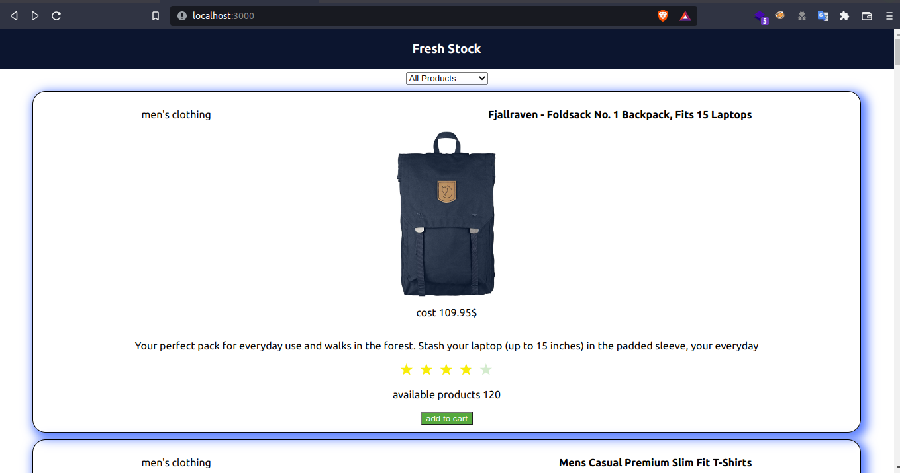
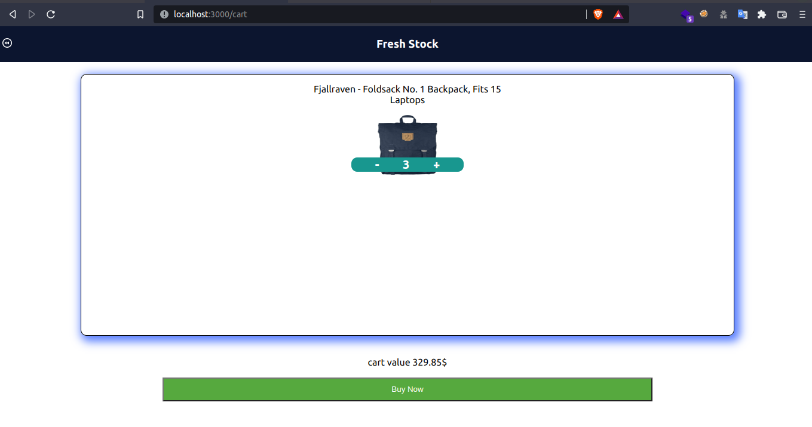
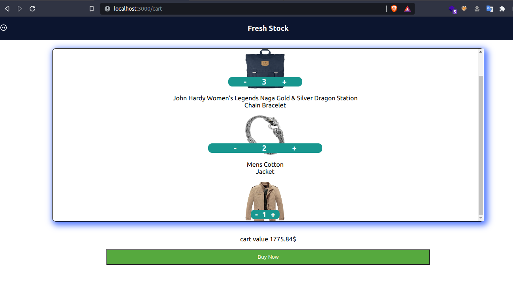
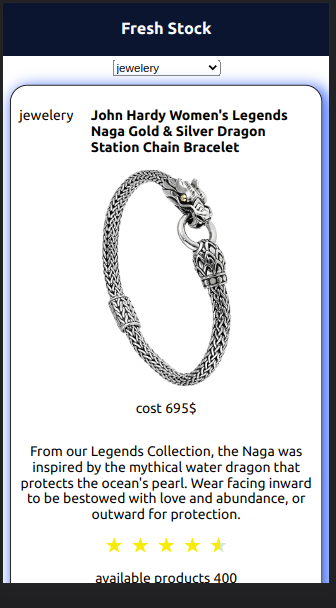

# ShopingApp-MERN

## backend

created 2 api end points

```
[get] /api/getdata
[post] /api/checkout
```

getdata api fetch api from fakestoreapi.com and send json response

checkout is post api whech send final sum of final cost to backend

## frontend





filters products based on category

